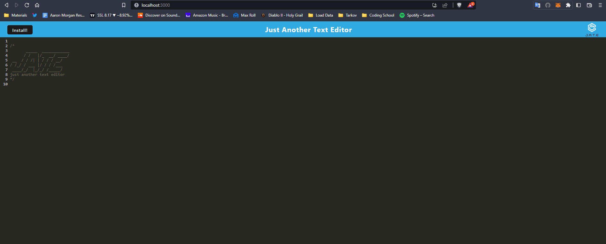

# PWA Text Editor

- 

## PWA Text Editor

- https://craymorgana-pwa.herokuapp.com/

## Description

- This is basic text editor app that can be downloaded to your desktop and will save the text you've entered from localhost and bring it over to the downloaded app!
- This app is meant to show a progressive web application that can run quickly as well as be installed onto your desktop.

* [PWA Text Editor](https://github.com/craymorgana/pwaTextEditor "Named link title")

## Installation

- Run 'npm run install' to install all packages for both the client and server folders.
- Run 'npm run start' to run the application on your local host

## License

Please refer to license page by clicking on the badge to learn more

- .

## Questions

- Github Profile: https://github.com/craymorgana
